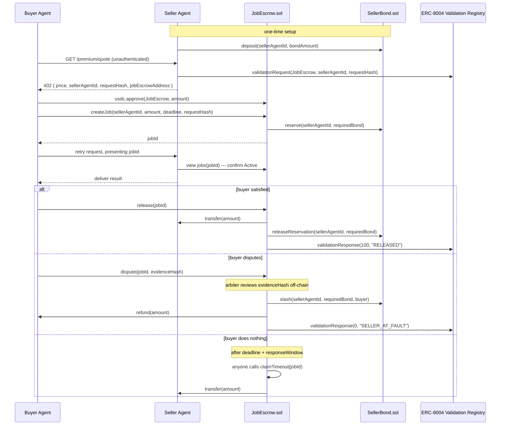
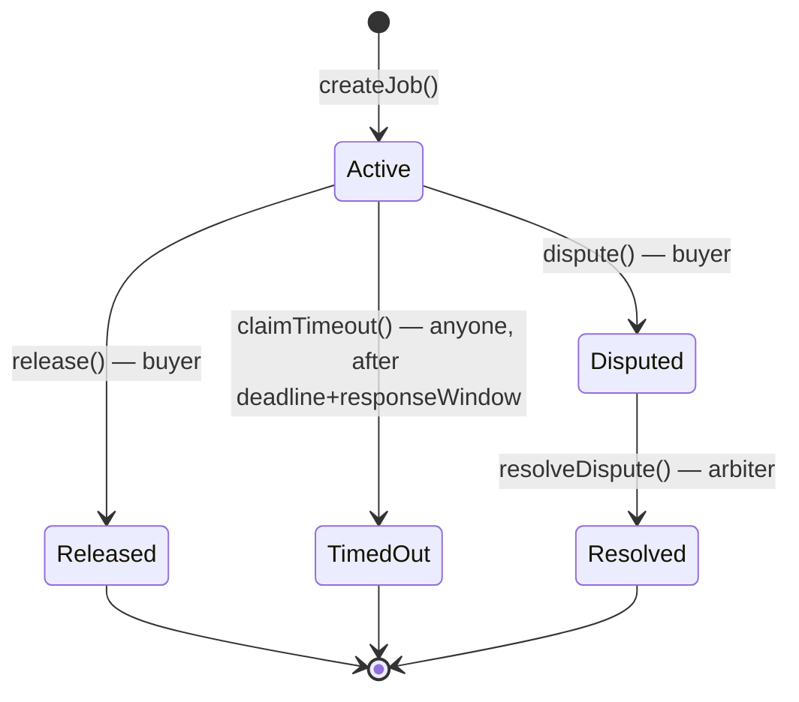

# Tripwire — Complete Project Overview

## 1. The track, and why this is the right shape of answer

**Agentic Economy Track**: "Build autonomous agents that transact on Arc." Judges are looking for agents with decision logic tied to real signals, autonomous spending/payments/settlement in USDC, use of Agent Stack to connect agents to wallets/payments/onchain actions, and use of Nanopayments, Paymaster, or App Kits where relevant. Core products called out: **Arc, USDC, Agent Stack, App Kits, Circle Wallets, Circle Contracts, Nanopayments, Paymaster.**

Tripwire's "decision logic tied to a real signal" is literally the product: a buyer agent's own judgment of whether delivered work is acceptable (backed by an evidence hash on dispute), gated against a seller's posted, slashable collateral. The settlement itself — release, refund, slash — is autonomous once a job is created; only a disputed outcome touches a human-equivalent arbiter, and that's disclosed as a centralized, hackathon-scoped placeholder, not hidden.

## 2. The gap being filled

- **x402** payments settle irreversibly today — its own spec/FAQ lists escrow-style conditional transfer as explicit future work, not something it does now.
- **Circle's Agent Stack terms of service** state plainly that Circle does not guarantee the performance, availability, or outcome of agent-initiated transactions with third parties.
- **ERC-8004** gives agents portable identity and reputation — it says nothing about whether a given payment should actually go through.

Tripwire is the missing settlement condition: money doesn't fully move until the job is verified done, and if it isn't, the seller's own posted stake compensates the buyer. It sits downstream of all three systems above, extending each rather than replacing any of them.

## 3. Arc / Circle product map

| Product | What it is | Role in Tripwire | Arc support |
|---|---|---|---|
| **Arc** | Circle's L1 network (testnet chain ID `5042002`) | Deploy target for `SellerBond.sol` and `JobEscrow.sol`; native gas token is USDC itself | — (this *is* the chain) |
| **USDC** | The settlement currency | Bond deposits, job escrow deposits/releases/refunds, slashes — every fund movement in the system; also Arc's own gas token | Native, `0x3600...0000` |
| **Agent Stack** | Umbrella term for Circle's agent tooling (wallets, custody, policy) | Buyer and seller agents hold/move USDC through this layer; Tripwire's contracts sit strictly downstream of a payment the agent's own wallet already approved — we don't duplicate its spend-limit/allowlist enforcement | Yes |
| **Circle (Agent) Wallets** | 2-of-2 MPC custody, time-bound spend caps, recipient allowlists | Buyer and seller each hold one; this is where "the agent only ever holds USDC" and "the human retains ultimate control" both actually live | Yes |
| **App Kits** (Bridge/Swap/Send/Unified Balance SDKs) | `@circle-fin/app-kit` — cross-chain USDC bridging via CCTP, same/cross-chain swap, wallet-to-wallet send, unified multi-chain balance | Confirmed live, Arc-specific tutorials exist (bridging USDC *to* Arc Testnet is the flagship example). **Stretch-goal fit**: onboarding buyer/seller funds from another testnet onto Arc via Bridge Kit before a job starts. Not on the MVP critical path — faucet funding covers the demo directly on Arc | Yes, explicitly documented |
| **Circle Contracts** (formerly "Smart Contract Platform") | No-code console + API/SDK to deploy, manage, and monitor smart contracts — audited templates or your own bytecode+ABI | Confirmed live on Arc Testnet (rolled out ~Dec 2025), with Gas Station auto-sponsoring deployment gas for dev-controlled wallets. **We're using Foundry as primary** per this project's explicit tech-stack choice (build/test/dev-loop reasons, see §7); Circle Contracts is a legitimate alternative deploy/management path if leaning harder into this product matters for judging, at the cost of a less-trodden path for custom bytecode on Arc specifically (the public quickstart only demonstrates the audited templates) | Yes, dated announcement + dedicated Arc tutorial |
| **Nanopayments** (Circle Gateway / x402 batching) | Batched off-chain-signed, on-chain-settled micropayments | Still used unchanged for service discovery/pricing (the 402 quote step); optionally used again *after* a job resolves, when the seller's backend deposits released funds into their Gateway balance. **Deliberately bypassed for the job-payment settlement step itself** — its whole value proposition is instant, irreversible settlement, which is exactly the problem Tripwire exists to solve, so buyer funds go into escrow via a plain USDC `approve`/`transferFrom` instead | Yes (this is what the forked repo already does) |
| **Paymaster** | ERC-4337 account-abstraction gas sponsorship | **Not supported on Arc at all** (confirmed: supported networks are Arbitrum/Base/Avalanche/Ethereum/Optimism/Polygon/Unichain; no Paymaster address anywhere in Arc's docs). Turns out not to matter: Arc's native gas token *is* USDC, so "agents never hold a separate gas currency" is already true by construction. (Circle Contracts' own Gas Station *does* auto-sponsor gas for its dev-controlled wallets on Arc Testnet — a real, narrower gasless story that does exist today, distinct from Paymaster.) | No — documented honestly as a gap, with the mitigating fact alongside it |
| **ERC-8004** *(not a track "core product," but required by the project)* | Portable on-chain agent identity (Identity Registry) + attestation (Validation Registry) | Buyer and seller each register an `agentId`; `SellerBond` keys bond balances by `agentId`; `JobEscrow` writes completion/dispute attestations to the Validation Registry | Both registries confirmed live and verified on Arc testnet |

## 4. System architecture

**Actors**: Buyer Agent, Seller Agent, `JobEscrow.sol`, `SellerBond.sol`, ERC-8004 Identity Registry, ERC-8004 Validation Registry, and (post-release only) Circle Gateway.

**Job state machine:**

## 5. Contract design

### `SellerBond.sol`

Sellers post USDC stake against their ERC-8004 `agentId` before taking jobs. Bond is **reserved per job**, not just ratio-checked at creation — this is the one meaningful departure from the original spec's shape, closing a gap where concurrent jobs against one bond could all individually pass a ratio check and then simultaneously be un-fundable at dispute time.

- `deposit(agentId, amount)` — permissionless top-up via `transferFrom`.
- `requestWithdrawal(agentId, amount)` / `completeWithdrawal(agentId)` — timelocked (3-day default, owner-settable, snapshotted per-request so a later timelock change never affects an in-flight request). Only the agentId's owner/operator (checked via the Identity Registry) can request.
- `reserve(agentId, amount)` / `releaseReservation(agentId, amount)` — **new, `onlyJobEscrow`**. Locks/unlocks a specific amount against `reserved[agentId]`.
- `slash(agentId, amount, recipient)` — `onlyJobEscrow`; can only ever consume `amount <= reserved[agentId]` — enforcing that a slash can never touch anything beyond what was actually locked for the job being resolved.
- `bondOf(agentId)` — view, **net of both pending withdrawal and reservations** (`bondBalance - pendingWithdrawal - reserved`) — the true "free" bond a new job can draw against.

### `JobEscrow.sol`

- `createJob(sellerAgentId, amount, completionDeadline, validationRequestHash)` — buyer calls; verifies the seller's `validationRequestHash` names this contract as validator; computes `requiredBond = amount * minBondRatioBps / 10000` (default 20%, owner-settable) and calls `sellerBond.reserve(...)` — reverts here if the seller's free bond is insufficient; snapshots the seller's payout address; pulls `amount` USDC into escrow.
- `release(jobId)` — buyer calls once satisfied; pays seller in full, releases the bond reservation, writes an optimistic `validationResponse`.
- `dispute(jobId, evidenceHash)` — buyer calls instead, any time before `completionDeadline + responseWindow`; records an evidence hash on-chain (not raw evidence).
- `resolveDispute(jobId, sellerAtFault)` — single arbiter (deployer wallet, explicitly centralized-for-now). At fault: slashes exactly the job's reserved bond, refunds the buyer's escrowed principal, writes a fault attestation. Not at fault: releases normally.
- `claimTimeout(jobId)` — callable by anyone once `completionDeadline + responseWindow` has passed with no buyer action; auto-releases to the seller so a buyer can't grief a seller by doing nothing forever.
- Every Validation Registry write is wrapped in `try/catch` behind an owner-toggleable `validationRegistryEnabled` flag, so an unstable or misbehaving registry call (the registry's own spec is still under active discussion) can never brick fund movement.

Dispute window and timeout grace period from the original spec are merged into one owner-settable `responseWindow` (default 48h) — they described the same interval from two sides.

## 6. Backend / agent integration (forked `arc-nanopayments`)

- **Buyer** (`agent.mts`): replace the current single opaque `gateway.pay()` call — that SDK method can't be intercepted mid-flow — with: unauthenticated request → read the 402 payload (`price, sellerAgentId, requestHash, jobEscrowAddress`) → `usdc.approve()` + `JobEscrow.createJob()` → retry the request presenting `jobId` → check the response is non-empty/matches what was requested (tighter validation is an explicit stretch goal) → `release()` or `dispute()`.
- **Seller** (`lib/x402.ts`'s `withGateway()` wrapper): replace the `facilitator.settle()` call with: on an unauthenticated request, submit `validationRequest()` naming `JobEscrow` as validator and return the 402 payload above; on a request presenting `jobId`, view-call `JobEscrow.jobs(jobId)` to confirm it's `Active` and matches this route's price, then let the existing handler run unchanged. The individual paywalled routes (`quote`, `dataset`, `compute`, `agent-task`) need little to no change — all the rewiring is centralized in `lib/x402.ts`.
- **Release → Gateway deposit**: after a buyer's `release()` tx confirms, the seller's backend independently re-verifies on-chain state, then optionally deposits the released funds into their Gateway balance, mirroring the existing withdraw-flow pattern already in the fork.

## 7. Build sequence

1. **Phase 0** — Fork `arc-nanopayments`, confirm the unmodified buyer→seller x402 flow works end-to-end on Arc testnet, faucet-funded. `forge init` a `contracts/` Foundry project alongside it. Register buyer/seller `agentId`s. Sanity-check the USDC contract behaves as plain ERC20.
2. **Phase 1** — `SellerBond.sol`: skeleton first, then `deposit`/`bondOf`, then withdrawal timelock, then `reserve`/`releaseReservation`/`slash`. Tests green at each step.
3. **Phase 2** — `JobEscrow.sol` (Validation Registry disabled initially): skeleton, then `createJob`/`release` happy path, then `dispute`/`resolveDispute`, then `claimTimeout`.
4. **Phase 3** — Wire the real ERC-8004 Validation Registry ABI in, with the `try/catch` resilience path tested explicitly.
5. **Phase 4** — Deploy to Arc testnet (confirm before spending faucet funds): `JobEscrow` → `SellerBond` → `setSellerBond()`; verify both on Arcscan.
6. **Phase 5** — Backend rewiring (buyer + seller), can start once Phase 2's interfaces are stable.
7. **Phase 6** — Demo scripts + README, started as soon as Phase 2 is done, independent of backend wiring finishing.
8. **Phase 7 (stretch)** — Tighter delivery validation, dashboard polish, App Kit bridging if time allows.

## 8. Test plan (Foundry)

Bond: deposit/withdraw-timelock/slash-only-by-`JobEscrow`/`reserve`-`releaseReservation` access control. JobEscrow: bond-ratio-gated `createJob`, **two concurrent jobs against one bond both succeeding and both being fully slashable on simultaneous disputes** (the property the reservation model exists to guarantee), `release`/`dispute`/`resolveDispute`/`claimTimeout` state-machine and access-control tests, and a `try/catch` resilience test proving a reverting Validation Registry call never blocks fund movement. Plus one fork test (`vm.createSelectFork`) against the real Arc testnet registries as a pre-deploy gate.

## 9. Demo plan

1. **Clean run**: deposit → delivery → `release()`. Show the seller's balance move.
2. **Disputed run**: deposit → bad/no delivery → `dispute()` → `resolveDispute(sellerAtFault=true)` → show the bond getting slashed and the buyer refunded.

Both recorded via terminal output plus the Arc block explorer, per the project's demo script.

## 10. Honest disclosures (for the README)

- Dispute resolution is single-arbiter (the deployer wallet) for the hackathon — centralized-for-now, not pretend-decentralized.
- ERC-8004's Validation Registry spec is itself still under active discussion; integration is defensively wrapped so it can never brick settlement.
- Circle Paymaster isn't available on Arc yet; Arc's native USDC gas token already satisfies the underlying "agents only hold USDC" requirement without it.
- Bond reservation is now a real per-job lock (not a cheap ratio-only approximation) — chosen deliberately over the faster mitigation once the gap was identified, because the fix was tractable within the build window.
