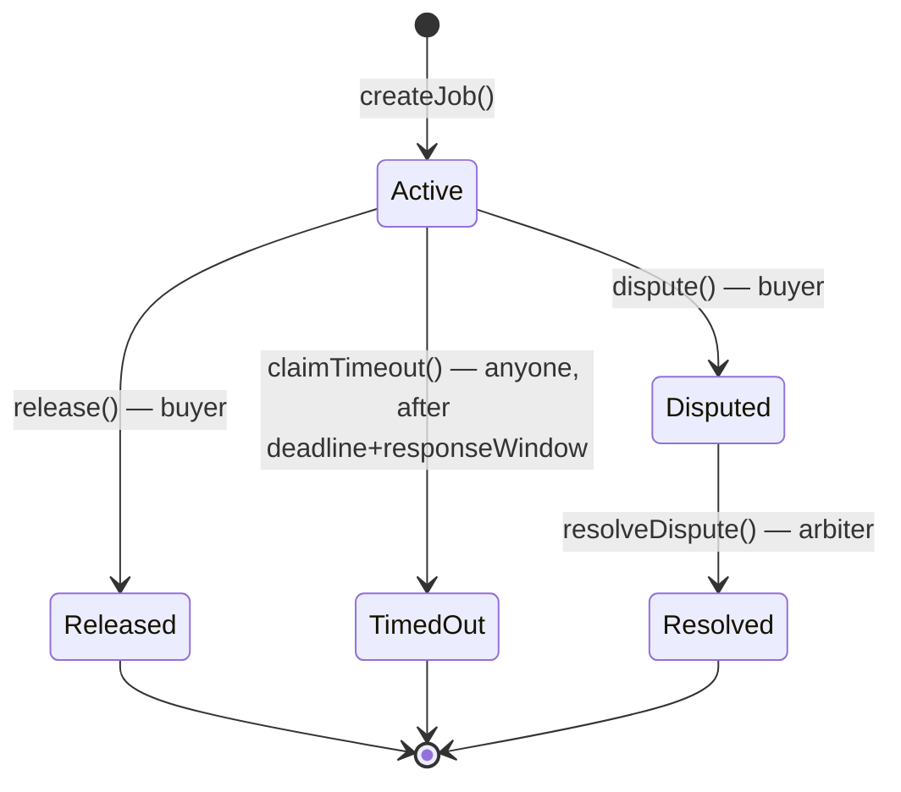
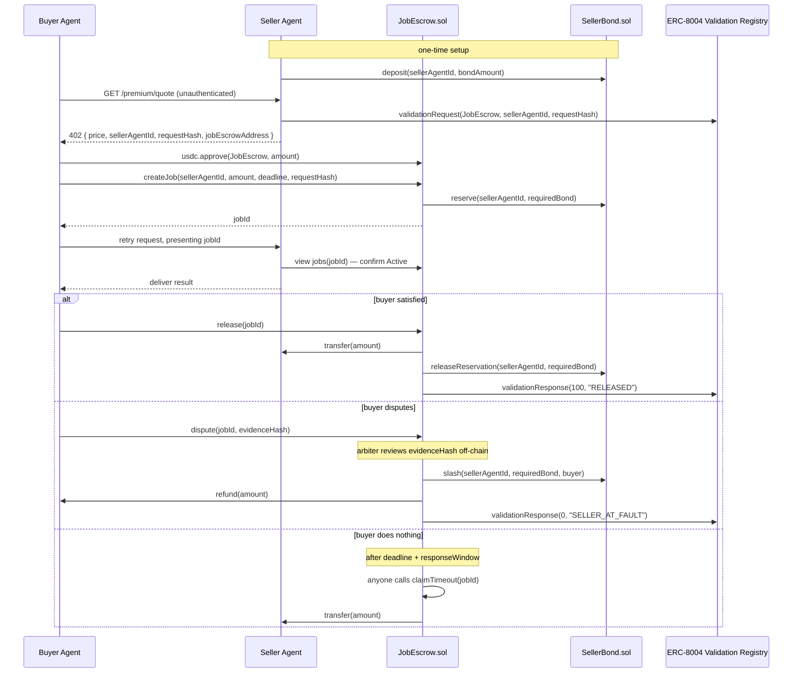

# 3. `JobEscrow.sol`

Status: **design confirmed, not yet implemented.** Depends on
[`01-research-and-decisions.md`](01-research-and-decisions.md) and
[`02-seller-bond.md`](02-seller-bond.md) — `JobEscrow` is the only caller allowed to move a
seller's reserved bond, so its interface assumes `SellerBond`'s is already settled.

## Purpose

One job = one escrowed payment. Buyer's USDC sits here until the buyer releases it, an
arbiter resolves a dispute in the seller's favor, or a timeout auto-releases it — never
before.

## State

```solidity
enum JobStatus { None, Active, Released, Disputed, Resolved, TimedOut }

struct Job {
    address buyer;
    uint256 sellerAgentId;
    address sellerPayoutAddress;   // snapshotted via identityRegistry.ownerOf() at creation
    uint256 amount;
    uint256 reservedBond;          // amount * minBondRatioBps / 10000 at creation time — fixed for this job's lifetime
    uint64  completionDeadline;
    uint64  responseDeadline;      // completionDeadline + responseWindow, snapshotted at creation (added post-audit, 2026-08-03 — see invariant 5)
    JobStatus status;
    bytes32 validationRequestHash;
    bytes32 evidenceHash;
}

IERC20 public immutable usdc;
IIdentityRegistry public immutable identityRegistry;
IValidationRegistry public immutable validationRegistry;
address public immutable arbiter;
address public owner;
ISellerBond public sellerBond;                 // settable exactly once post-deploy

bool    public validationRegistryEnabled = true;
uint256 public minBondRatioBps = 2000;          // 20% default, owner-settable
uint64  public responseWindow = 48 hours;       // owner-settable
uint64  public constant MAX_JOB_DURATION = 365 days; // not owner-settable — structural overflow guard, see invariant 6

mapping(uint256 => Job) public jobs;
uint256 public nextJobId;
```

## Functions

```solidity
function createJob(uint256 sellerAgentId, uint256 amount, uint64 completionDeadline, bytes32 validationRequestHash) external returns (uint256 jobId);
function release(uint256 jobId) external;                          // onlyBuyer, status==Active
function dispute(uint256 jobId, bytes32 evidenceHash) external;    // onlyBuyer, status==Active, before deadline+responseWindow
function resolveDispute(uint256 jobId, bool sellerAtFault) external; // onlyArbiter, status==Disputed
function claimTimeout(uint256 jobId) external;                     // anyone, status==Active, now > deadline+responseWindow
function setSellerBond(address sellerBond_) external;               // onlyOwner, settable exactly once
function setMinBondRatioBps(uint256 newRatioBps) external;          // onlyOwner
function setResponseWindow(uint64 newWindow) external;              // onlyOwner
```

Listed explicitly since 2026-07-31 (previously only implied by the state section's "owner-settable"/"settable exactly once" comments, same class of gap plan 02 had with `setWithdrawalTimelock` before that was corrected):

- **`setSellerBond(address sellerBond_)`** — one-time wiring call, not a tunable parameter.
  Resolves the circular deploy dependency: `JobEscrow` is deployed first (this unset),
  `SellerBond` deploys second with `JobEscrow`'s now-known address baked in as `immutable`,
  then this is called exactly once to complete the wiring. Reverts
  `SellerBondAlreadySet()` if called again.
- **`setMinBondRatioBps(newRatioBps)`** — the risk parameter from `CLAUDE.md`'s spec
  ("make it configurable — this is a risk parameter, not a fixed constant"). Applies to
  jobs created after the change; an already-active job keeps its snapshotted
  `reservedBond` (invariant 1).
- **`setResponseWindow(newWindow)`** — same category as `SellerBond.setWithdrawalTimelock`:
  a live demo recording can't wait out a hardcoded 48h to show the timeout path, so this
  needs to be adjustable down for the recording. Applies to jobs created after the change.

### `createJob`
Validates `amount > 0`, `completionDeadline > now`. If `validationRegistryEnabled`, verifies
`validationRequestHash` names this contract as validator for `sellerAgentId` (exact getter
name TBD — pull the real ABI off Arcscan for `0xDB31f5d9167f8ebc8B30FbBF814c4d297c2D7F99`
before writing this check; see the open question in
[`01-research-and-decisions.md`](01-research-and-decisions.md)). Snapshots
`sellerPayoutAddress = identityRegistry.ownerOf(sellerAgentId)`. Computes
`reservedBond = amount * minBondRatioBps / 10000` and calls
`sellerBond.reserve(sellerAgentId, reservedBond)` — reverts here if bond is insufficient (no
separate ratio check needed in `JobEscrow`; `SellerBond` is the source of truth). Pulls
`amount` USDC via `SafeERC20.safeTransferFrom`.

### `release`
Pays `sellerPayoutAddress` the full `amount`. Calls
`sellerBond.releaseReservation(sellerAgentId, reservedBond)`. `try/catch`-wrapped
`validationResponse(..., 100, ..., "RELEASED")`.

### `dispute`
Records `evidenceHash` (the hash, not raw evidence), flips status to `Disputed`. No fund
movement yet — that only happens on `resolveDispute`.

### `resolveDispute(sellerAtFault=true)`
`sellerBond.slash(sellerAgentId, reservedBond, buyer)`; separately refunds the escrowed
`amount` to `buyer` from `JobEscrow`'s own holdings; `try/catch`-wrapped low-score
`validationResponse(..., 0, ..., "SELLER_AT_FAULT")`.

### `resolveDispute(sellerAtFault=false)` / `claimTimeout`
Same payout path as `release` — pay seller, release reservation, optimistic
`validationResponse`.

## Invariants this contract must uphold

1. Every job's `reservedBond` is fixed at creation and is the *only* amount ever slashed or
   released for that job — no recomputation later, no partial-slash fallback needed.
2. A job's status only ever moves forward through the state machine below — never backward,
   never skips a required precondition.
3. A Validation Registry call failing (reverting) must never block fund movement — every call
   into it is `try/catch`-wrapped behind `validationRegistryEnabled`.
4. `dispute`/`release` are only callable before a job's `responseDeadline`; `claimTimeout` is
   only callable after it — the two are mutually exclusive by construction, not by a race
   that could double-pay.
5. **Added post-audit, 2026-08-03**: `responseDeadline` is snapshotted once at `createJob()`
   time (`completionDeadline + responseWindow` as of that moment) and never recomputed from
   the live `responseWindow` — same reasoning as invariant 1 for `reservedBond`, and the same
   pattern `SellerBond.pendingWithdrawal.unlockTime` already uses. Audit finding: without this,
   an owner changing `responseWindow` mid-flight retroactively shifts every in-flight job's
   effective deadline — shortening it could let a stranger force-`claimTimeout` a job before
   the buyer's dispute window they were promised had actually elapsed.
6. **Added post-audit, 2026-08-03**: `completionDeadline` is capped at `block.timestamp +
   MAX_JOB_DURATION` in `createJob` — not owner-settable, a structural bound rather than a
   risk parameter. Audit finding: without it, `completionDeadline` near `type(uint64).max`
   (a plausible "no real deadline" sentinel — this codebase's own tests already use
   `type(uint256).max` as an "infinite" USDC allowance) makes
   `completionDeadline + responseWindow` overflow uint64 and revert in every one of
   `release`/`dispute`/`claimTimeout` (and transitively `resolveDispute`, which requires
   `dispute()` to have succeeded first) — permanently locking that job's escrowed funds and
   the seller's reserved bond with no recovery path.
7. **Added post-audit, 2026-08-03**: `minBondRatioBps == 0` is a genuinely supported
   configuration, not just a documented-but-broken one. `createJob`/`release`/
   `resolveDispute`/`claimTimeout` all guard their `SellerBond` calls behind
   `reservedBond > 0`, since `SellerBond.reserve`/`releaseReservation`/`slash` all reject
   zero-amount calls — without the guard, every `createJob` call would revert while the ratio
   is 0, silently breaking the documented demo/testing configuration.

## Job state machine



## Full flow (happy path + both failure paths)



## Open questions / assumptions

- Validation Registry getter name for the `createJob` validator check — see
  [`01-research-and-decisions.md`](01-research-and-decisions.md).
- Whether `sellerPayoutAddress` should re-read `identityRegistry.ownerOf()` at payout time
  instead of using the value snapshotted at `createJob()` — currently planned as
  snapshot-at-creation (protects a job in flight from an agent ownership transfer mid-job);
  flag if that's the wrong tradeoff.

## Build order (see [`05-testing.md`](05-testing.md) for matching tests)

Validation registry disabled initially: skeleton → review → `createJob`/`release` happy path
wired to the real `SellerBond` (two-step deploy) → `dispute`/`resolveDispute` including the
reservation-slash path → `claimTimeout`. Full suite green with mocked registries before
Phase 3 wires in the real Validation Registry.
